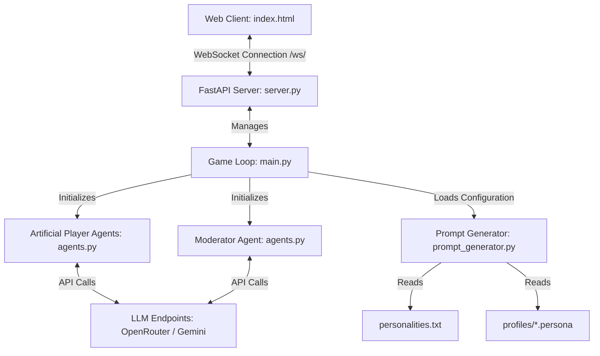
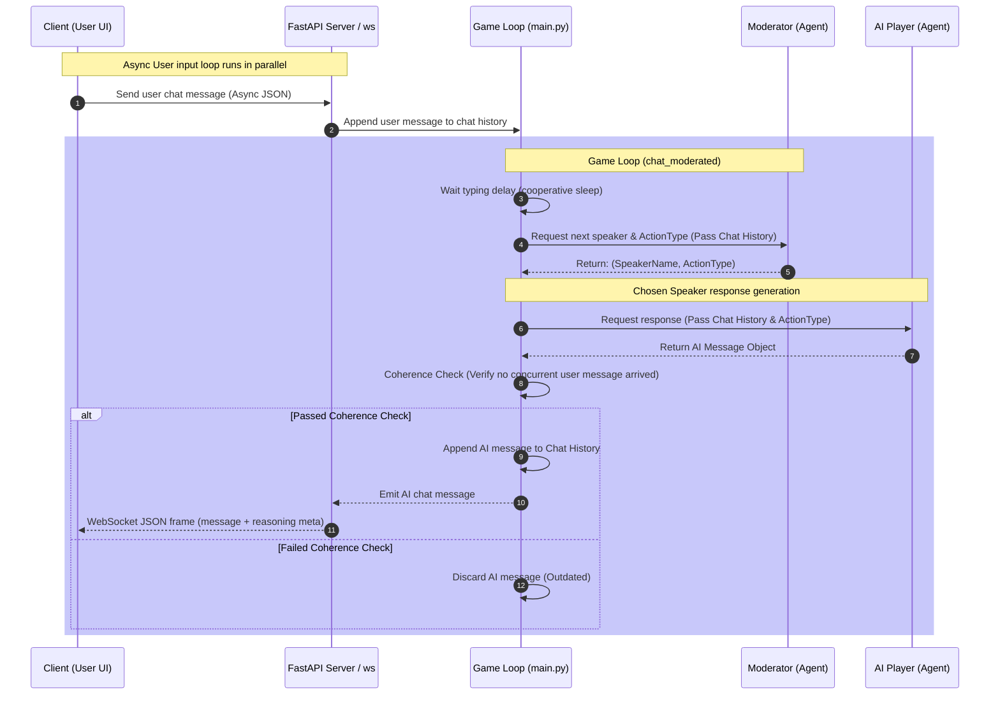

# Project Status, Architecture, and Roadmap

This document outlines the system architecture, current project state, file structure, and next strategic goals for the **"I Am A Robot"** social deduction agent game.

---

## 1. System Architecture

The project is structured as a real-time multiplayer-style web application where a single human player interacts with multiple LLM-based artificial players in a chatroom environment. A dedicated Moderator agent controls the flow.



### Game Loop Flow




### Core Components

1. **Frontend (Game Client)**:
   - Location: `backend/static/index.html`
   - Role: Single-page application rendering the chatroom interface, game configurations (duration, speech rules, speed, API key), and real-time outputs (chat transcripts, agent reasoning processes, and voting outcomes).
   - Protocol: Communicates with the backend using WebSockets (`ws://<host>/ws/{player_name}`).

2. **FastAPI Web Server**:
   - Location: `backend/server.py`
   - Role: Serves the static client, lists available character profiles via `/api/profiles`, and establishes WebSocket sessions to pipe messages asynchronously between the client and the active game loop.

3. **Game Controller**:
   - Location: `backend/main.py`
   - Role: Orchestrates the game lifecycle. Runs `chat_moderated()` where the moderator decides who speaks and under which behavior, handles the countdown timer, conducts the voting process, collects agent reasoning trails, and evaluates the final win/loss state.

4. **Agent Infrastructure**:
   - Location: `backend/agents.py`
   - Role: Implements the base `Agent` class wrapper over the OpenAI/AsyncOpenAI completion clients. Connects to OpenRouter or Google Gemini endpoints.
   - `Player`: Role-plays as a participant, generating messages and evaluating suspects during voting.
   - `Moderator`: Directs the conversation by selecting the next speaker and setting their action type (e.g. `ASK_QUESTION`, `Joke`, `Attack`).

5. **Prompt Engineering Engine**:
   - Location: `backend/prompt_generator.py`
   - Role: Dynamically constructs LLM prompts. Incorporates options like word limits, speech imperfections, hidden motives, background narratives (applying Ernest Hemingway's Iceberg Theory), and structured YAML profiles.

---

## 2. Project State

### File Directory Structure

```
├── backend/
│   ├── profiles/                  # Custom agent profiles (.persona files)
│   │   ├── hoid.persona
│   │   ├── lift.persona
│   │   ├── mix.persona
│   │   ├── sylphrena.persona
│   │   └── trashtalker.persona
│   ├── static/
│   │   └── index.html             # Frontend client
│   ├── .env                       # API configurations (OpenRouter & Gemini)
│   ├── agents.py                  # LLM agent definitions (Player, Moderator)
│   ├── main.py                    # Game loop and evaluation logic
│   ├── Makefile                   # Utility commands for setup
│   ├── personalities.txt          # Text-based personality database
│   ├── prompt_generator.py        # System and user prompt builder
│   ├── response_times.txt         # Execution log for LLM latency tracking
│   ├── server.py                  # Web API and WebSocket host
│   └── test.http                  # HTTP test requests
├── trending_topics.json           # Unutilized list of conversation starters
├── requirements.txt               # Project dependencies
└── README.md                      # Project root documentation
```

### Key Configurations & Features Implemented
- **Hemingway's "Iceberg Theory" Integration**: Secret motives and backgrounds shape responses via subtle subtext rather than direct statements.
- **WebSocket Asynchrony**: Dual sender/receiver loops running concurrently to guarantee immediate message delivery and responsive gameplay.
- **Action-Driven Conversations**: Agent behaviors are structured around specific action types decided by the Moderator, which prevents simple generic messaging.
- **Error Resiliency**: Multi-tier API key fallbacks (supporting both OpenRouter keys and Google Gemini keys with path-rewrites to OpenAI-compatible base URLs).

---

## 3. Roadmaps and Next Goals

### Topic Integration & Dynamic Extraction (ML Agents)

Currently, the project contains a list of 11 realistic trending topics in `trending_topics.json`, but the game loop does not use them. Expanding this is a priority:

1. **Integration into the Game Loop**:
   - Update `PromptGenerator` to parse `trending_topics.json`.
   - Incorporate the chosen topic into the initial system prompt, anchoring the agents' discussion around a common theme (e.g. a recent news story or viral meme) to make human detection harder.

2. **Automated ML Topic Extraction Pipeline**:
   - Build a background worker/script (`backend/topic_extractor.py`) that uses an LLM to scrape and extract current trending topics from online platforms (e.g., RSS feeds, Reddit API, Google Trends).
   - Implement an extraction agent that structures these topics into the format required by the json file:
     $$\text{Topic Output} = \{ \text{Text Summary with colloquial hook} \}$$
   - This ensures the agents are always discussing current, fresh events, making their responses mimic real-time social media users.

### Game Mode Expansion (Social Deduction Variant)

Based on the blueprint in `system_prompts.txt`, implement the advanced **Supremacist vs. Police** game variant:
- **AI Supremacist**: Tries to locate the human player without alerting the Police.
- **AI Police**: Monitors logs to arrest the Supremacist, winning if they identify them correctly.
- **AI Citizens**: Engage in normal conversation, serving as noise/decoys.
